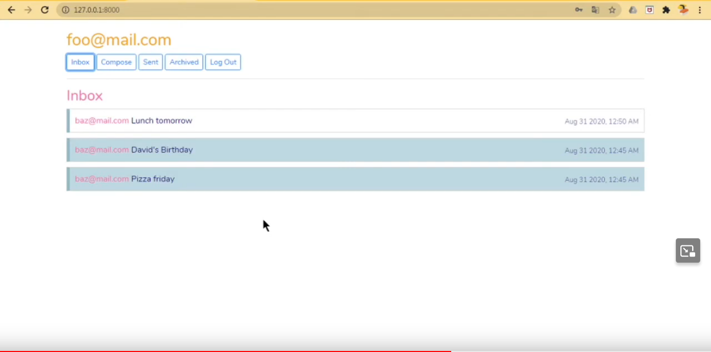

# Mail
## A front-end for an email client API
Project 3 - [CS50’s Web Programming with Python and JavaScript](https://cs50.harvard.edu/web/2020/)

Implemented using the Django framework and JavaScript.

For a full demo, see [this video](https://www.youtube.com/watch?v=BGia4-jpfbU&list=PL63wdUW0APKvFys2It2Ubgs6DslKpblW8).

### Specification

- Send Mail: When a user submits the email composition form, add JavaScript code to actually send the email.

- Mailbox: When a user visits their Inbox, Sent mailbox, or Archive, load the appropriate mailbox.

- View Email: When a user clicks on an email, the user should be taken to a view where they see the content of that email.

- Archive and Unarchive: Allow users to archive and unarchive emails that they have received.

- Reply: Allow users to reply to an email.

